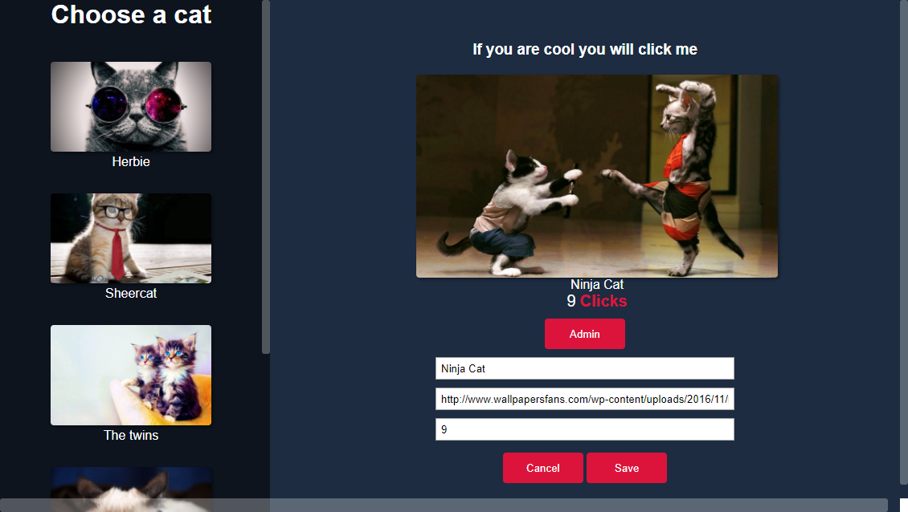

# cat-clicker
> Design Patterns Practice

app to improve the javascript design pattern as asignment of the Udacity Design Patterns Course

Here I am using the Model View Octopus as a way of organization pattern (octopus represents the concept of a controller in the Model  View Controller)
it was made without any framework just javascript and jquery

### Concept of the application
So we are trying to eliminate spaguetti code and use patterns instead starting with a simple cat clicker here are the specs from udacity:

that should display:

- a list of cats by name
- an area to display the selected cat
- an admin button
- an admin area with inputs for changing the cat's name, url, and number of clicks (hidden by default)

In the cat display area, the following should be displayed

- the cat's name
- a picture of the cat
- text showing the number of clicks

Interaction
- When a cat name is clicked in the list, the cat display area should update to show the data for the selected cat.
- The number of clicks in the cat area should be unique to each cat, and should increment when the cat's picture is clicked.
- When the admin button is clicked, the admin area should appear with the inputs filled in for the currently-selected cat.
- When the cancel button in the admin area is pressed, the admin area disappears.
- When the save button in the admin area is pressed, the currently-selected cat's values update with the values in the admin area, and the admin area disappears.
The specifics of the layout do not matter, so style it however you'd like.

I ended with that:


[run it]('https://codepen.io/freesgen/pen/GEXGBK')

so lets see the most important the code

__here's the model__
```javascript
const model = {
  init() {
    this.cats = [{
        id: 1,
        name: 'Herbie',
        clickCount: 0,
        picture: 'https://i0.wallpaperscraft.com/image/cat_face_glasses_thick_65455_300x168.jpg'
      },
      {
        id: 2,
        name: 'Sheercat',
        clickCount: 0,
        picture: 'http://wallpapercave.com/wp/TxarQV1.jpg'
      },
      {
        id: 3,
        name: 'The twins',
        clickCount: 0,
        picture: 'https://images6.alphacoders.com/334/334727.jpg'
      },
      {
        id: 4,
        name: 'BoredCat',
        clickCount: 0,
        picture: 'http://cdn.wallpapersafari.com/99/42/EU5PQL.jpg'
      },
      {
        id: 5,
        name: 'Ninja Cat',
        clickCount: 0,
        picture: 'http://www.wallpapersfans.com/wp-content/uploads/2016/11/ninja-cat-fight-funny_wallpaper.jpg'
      }
    ]
  },

  getAllCats(){
    return this.cats
  },

  getCat(id){
    var index = id - 1
    return this.cats[index]
  },

  updateClickCount(id){
    var index = id - 1
    this.cats[index].clickCount+=1
    return this.cats[index]
  },

  updateData(cat){
    const {id,name,picture,clickCount} = cat
    var index = id - 1
    this.cats[index] = cat
    return this.cats[index]
  }
}
```

__here's the octopus__ remember this is just the concept of a controller, a conector between the model and the view
```javascript
const octopus = {
  getCats(){
    return model.getAllCats();
  },

  updateDisplay(name){
    var activeCat =  model.getCat(name)
    displayView.init(activeCat)
  },

  updateClick(id){
    var activeCat = model.updateClickCount(id)
    displayView.init(activeCat)

  },

  updateData(cat){
    var activeCat = model.updateData(cat)
    displayView.init(activeCat)
  },

  init(){
    model.init()
    adminView.init()
    catListView.init()
    
  }
}
```

and here are the views, first the __displayview__ :
```javascript
const displayView = {
  init(cat){
    this.$display = $('.cat-display');
    displayView.render(cat)
  },

  render(cat){
    var activeCat = `
      
      <p class="cat-name">${cat.name}</p>
      <p class="click-number"> <span class="clicks">${cat.clickCount}</span><span class="text">Clicks</span></p>`
    
    adminView.setInformation(cat)
    this.$display.html(activeCat)
    displayView.clickHandler(cat.id)
  },
  clickHandler(id){
    this.activeCatId = id
    var activeCat = $(".active-cat")
    activeCat.on('click',function(){
      octopus.updateClick(id)
    })
  }
}
```
__listview__
```javascript
const catListView = {
  init(){
    this.catList  =  $('.cat-list')
    catListView.render()
    $('.cat-item').eq(0).click()
  },

  render(){
    this.catItems = ' '
    octopus.getCats().forEach(function(cat) {
      this.catItems += `<li class="cat-item">
        <p class="name">${cat.name}</p>
        <p class="cat-id">${cat.id}</p>
      </li>`
    }, this);
    this.catList.html(this.catItems);
    catListView.clickHandler()
  },
  
  clickHandler(){
      var catItem = $('.cat-item')
      catItem.on('click', function () {
      var $this = $(this)
      catItem.removeClass("selected")
      $this.addClass("selected")
      octopus.updateDisplay($this.find('.cat-id').text())
    })
  },
}
```

__adminview__:
```javascript
const adminView = {
  init(){
    this.adminForm   = $('.admin-form')
    this.catName     = $('#form-cat-name')
    this.catUrl      = $('#form-cat-url')
    this.catClicks   = $('#form-cat-clicks')
    var btnAdmin     = $('.btn-admin')
    var btnSave      = $('.btn-save')
    var btnCancel    = $('.btn-cancel')
   
   btnAdmin.on('click',function(){
    adminView.showAdmin()
   });

   btnCancel.on('click',function(){
     adminView.hideAdmin()
   })

   btnSave.on('click',function(){
     adminView.saveData()
   })
  },

  setInformation(cat){
    this.id = cat.id
    this.catName.val(cat.name)
    this.catUrl.val(cat.picture)
    this.catClicks.val(cat.clickCount)
  },

  showAdmin(){
    this.adminForm.addClass('visible')
  },

  hideAdmin(){
    this.adminForm.removeClass('visible')
  },

  saveData(){
    octopus.updateData({
      id: this.id,
      name: this.catName.val(),
      picture: this.catUrl.val(),
      clickCount: Number(this.catClicks.val())
    })

    adminView.hideAdmin()

  }
}
```

and for runnig al these we just call at the end `octopus.init()` and voila!
